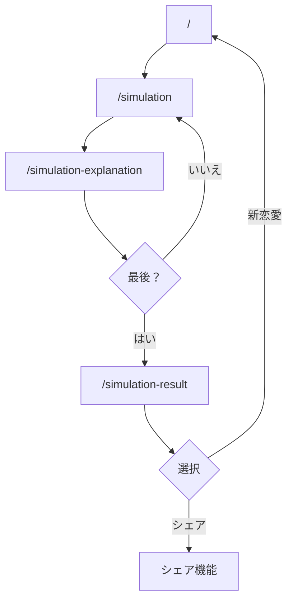

```// プロフィール情報
interface ProfileData {
  my: {
    age: string;
    gender: string;
    occupation: string;
    traits: string;
    preference: string;
    background: string;
    detailedDescription: string;
  };
  partner: {
    age: string;
    gender: string;
    occupation: string;
    traits: string;
    preference: string;
    background: string;
    detailedDescription: string;
  };
  relationship: string;
  stage: string;
  goal: string;
  numberOfQuestions: string;
}
```

## 画面遷移
